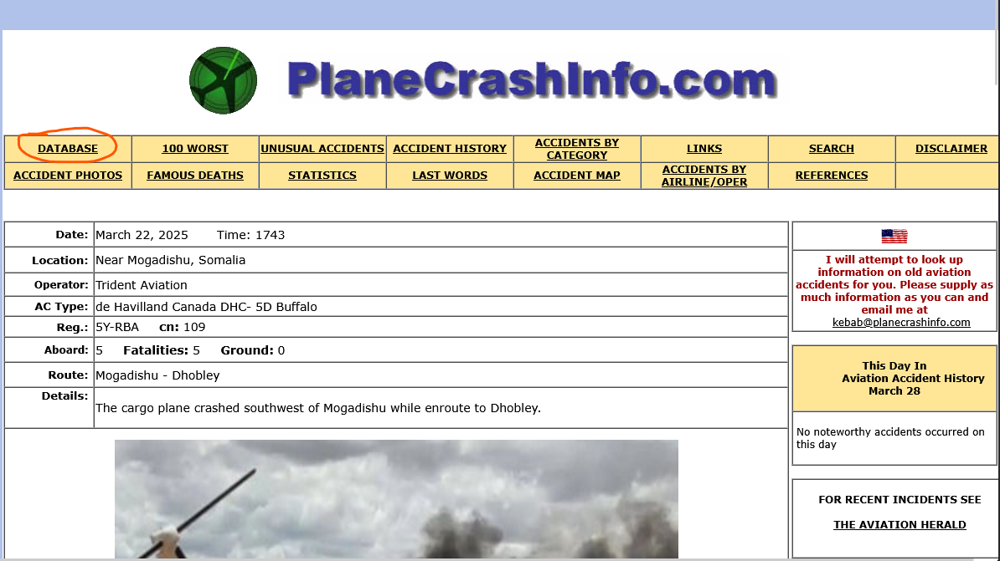
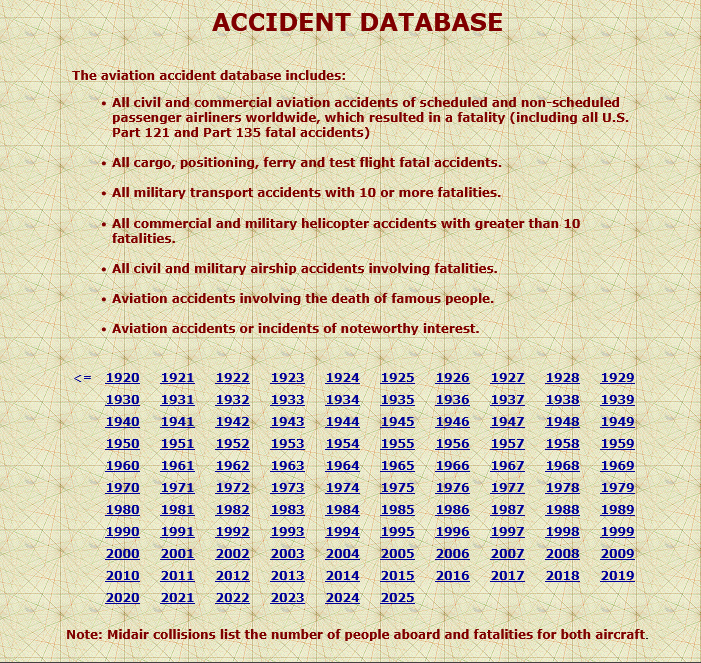
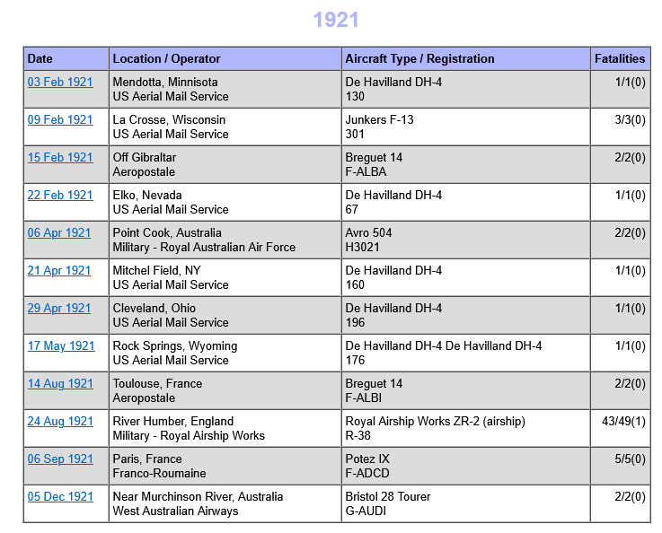
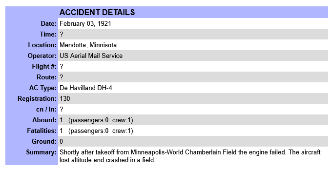
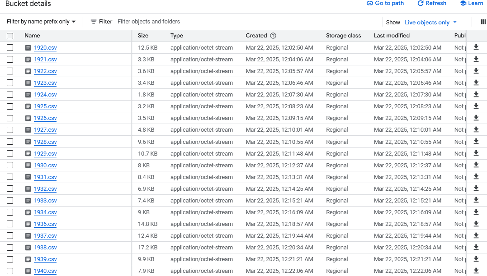
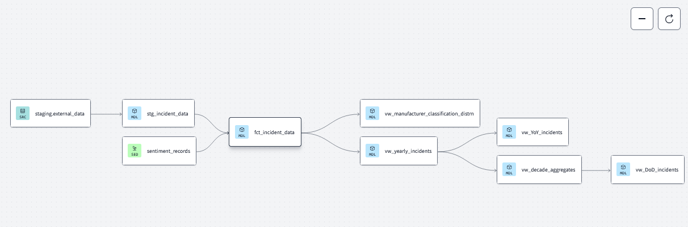

# Plane Incidents over the Century
### Introduction
Having been on several flights this year, this got me thinking about recent plane incidents, with Boeing being the manufacturer that instantly comes into mind, including the Sunita Williams space shuttle snafu.

On this, I recently read an article from [The Guardian](https://www.theguardian.com/us-news/2025/mar/01/plane-crash-safety-data) on plane safety data. as quoted from the article:
```
But the numbers suggest 2025 has actually been a relatively safe year to fly – at least in terms of the overall number of accidents". 
```
Let's exam this corollary, and find out for ourselves whether this is true using the power of data engineering
## Objective
Investigate flight safety over the last century (circa 1920 to 2025). 
We can use this data to answer some interesting questions are plane incidents
1. What's the Year over Year incident levels for the last 100 years
2. What's the decode over decade incident levels
3. What are the causes of incidents as summarized by AI (using gemini LLM in bigquery)
4. which manufacturer is calpable - investigating incidents classified as manufacturer defect/negligence 
### Data Sources
The [planecrashinfo](https://www.planecrashinfo.com/) website that collates incidents data from various sources.
The data is obtained by clicking on the database section of the website, 

after clicking on the database link, the years are displayed as below

on clicking on a selected year, the table below is shown

after clicking on a specific date, the below details are obtained. 


Fortunately, this process is automated in a Kestra flow, and the schema described in the <kbd>data</kbd> section is obtained


#### Data
The data contains the fields below: 
- Date
- Time
- Location
- Operator
- Flight
- Route
- AC Type
- Registration
- cn/ln
- Aboard
- Fatalities
- Ground
- Summary

### Technologies
- Docker (containerization)
- Terraform (infrastructure as code)
- Kestra (workflow orchestration)
- Google Cloud Storage (data lake)
- BigQuery (data warehouse)
  - Bigquery ML (summaries classification)
- dbt (data transformation)
- Looker Studio (data visualization)

## Data Pipeline


## Reproducability
<details>
<summary>GCP Setup</summary>

- Follow the GCP instructions in setting up a project

- We set up a service account to aide Kestra/Terraform/Other infrastructure tool in accessing the GCP platform. 
  
- Configure the GCP service account by accessing I&M and Admin -> service accounts -> create service account. Add the required roles (Bigquery Admin, Compute Admin and Storage Admin)

- To get the service account key, click on the dropdown -> manage keys -> create key (choose JSON). This downloads the key to be used in Kestra to setup Bigquery db and Bucket in this instance

</details>

<details>
<summary>Kestra Setup</summary>
Ensure to docker is setup and installed as per your operating system (ensure docker engine is installed). Follow the instructions [here](https://docs.docker.com/engine/install/). 

Go the [kestra website](https://kestra.io/docs/getting-started/quickstart#start-kestra) -> get Started -> goto the commands code. 

```
docker run --pull=always --rm -it -p 8080:8080 --user=root -v /var/run/docker.sock:/var/run/docker.sock -v /tmp:/tmp kestra/kestra:latest server local
```

Ensure to run the hello-world command to ensure docker is properly running

```
 sudo docker run hello-world
```

</details>

<details>
<summary>Infrastracture setup with Kestra</summary>

> Instead of using Terraform for this assignment, I preferred using a singular tool for the Infrastracture setup

</details>

### Data Warehouse
**Google Cloud Storage** - used for storing csv files that have been converted from the orchestration flow script. The CSV files are saved for individual years



**Bigquery** - create an external table with data from the bucket. This table is used in DBT to set the staging table, which assigns proper data types to the columns after the data cleaning process. The staging table is then used to create fact tables.

### LLM in Bigquery


### DBT Cloud



## [Dashboards](https://lookerstudio.google.com/s/h85L32U2D1E)
