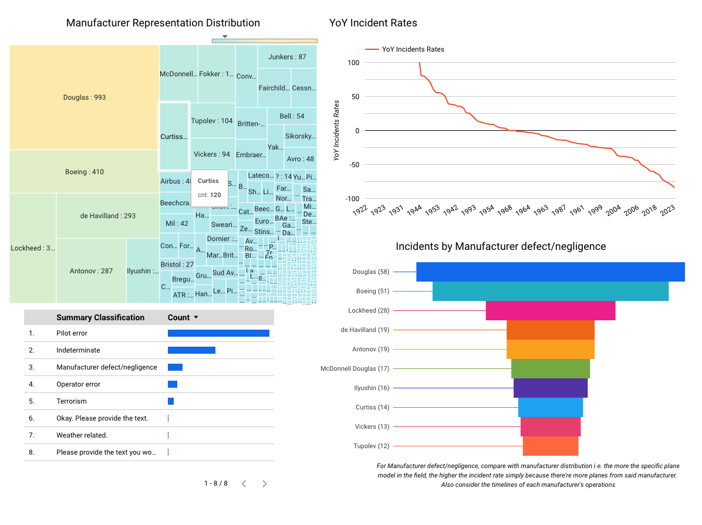

# Plane Incidents over the Century

### Table of contents

  - [Introduction](#introduction)
  - [Problem Statement](#problem-statement)
  - [Objective](#objective)
    - [Data Sources](#data-sources)
      - [Data (Schema)](#data-schema)
    - [Technologies](#technologies)
  - [Reproducability](#reproducability)
  - [Data Pipeline](#data-pipeline)
  - [Data Ingestion](#data-ingestion)
  - [Data Warehouse](#data-warehouse)
  - [BigQuery ML](#bigquery-ml)
  - [Transformations using DBT Cloud](#transformations-using-dbt-cloud)
  - [Dashboards](#dashboards)
  - [Conclusion](#conclusion)

---
---

### Introduction

<!--  -->
Having been on several flights this year got me thinking about recent plane incidents, with one of the major airline manufacturers instantly coming into my mind - thinking on the Sunita Williams space shuttle snafu.

On this, I recently read an article from [The Guardian](https://www.theguardian.com/us-news/2025/mar/01/plane-crash-safety-data) on plane safety data. As quoted from the article:

```
... But the numbers suggest 2025 has actually been a relatively safe year to fly – at least in terms of the overall number of accidents".
```

### Problem Statement
Let's examine this statement, and find out for ourselves whether this is true using our knowledge of data engineering

## Objective
Use data engineering methodologies to investigate flight safety over the last century (circa 1920 to 2025).

We can use this data to answer some interesting questions are plane incidents
1. What's the Year over Year incident levels for the last 100 years?
2. What's the decade over decade incident levels. Have things gotten better?
3. What are some of the causes of incidents as summarized by AI (using gemini LLM in bigquery)?
4. which manufacturer is calpable - investigating incidents classified as manufacturer defect/negligence?
### Data Sources
The [planecrashinfo](https://www.planecrashinfo.com/) website that collates incidents data from various sources.
The data is obtained by clicking on the database section of the website,


after clicking on the database link, the years are displayed as below


on clicking on a selected year, the table below is shown


after clicking on a specific date, the below details are obtained.


Fortunately, this process is automated in a Kestra flow, as described in the [data ingestion](#data-ingestion) section.
Below is the extracted schema

#### Data (Schema)
The data contains the fields below:
- Date
- Time
- Location
- Operator
- Flight
- Route
- AC Type
- Registration
- cn/ln
- Aboard
- Fatalities
- Ground
- Summary

### Technologies
- Docker (containerization)
- Terraform (infrastructure as code) - decided on using Terraform for tools uniformity
- Kestra (workflow orchestration)
- Google Cloud Storage (data lake)
- BigQuery (data warehouse)
  - Bigquery ML ([classification of summaries](#bigquery-ml))
- DBT Cloud (data transformation)
- Looker Studio (data visualization)

## Reproducability
<details>
<summary>GCP Setup</summary>

- Follow the GCP instructions in setting up a project

- We set up a service account to aide Kestra/Terraform/Other infrastructure tool in accessing the GCP platform.

- Configure the GCP service account by accessing I&M and Admin -> service accounts -> create service account. Add the required roles (Bigquery Admin, Compute Admin and Storage Admin)

- To get the service account key, click on the dropdown -> manage keys -> create key (choose JSON). This downloads the key to be used in Kestra to setup Bigquery db and Bucket in this instance

</details>

<details>
<summary>Kestra Setup</summary>
Ensure to docker is setup and installed as per your operating system (ensure docker engine is installed). Follow the instructions [here](https://docs.docker.com/engine/install/).

Go the [kestra website](https://kestra.io/docs/getting-started/quickstart#start-kestra) -> get Started -> goto the commands code.

```
docker run --pull=always --rm -it -p 8080:8080 --user=root -v /var/run/docker.sock:/var/run/docker.sock -v /tmp:/tmp kestra/kestra:latest server local
```

Ensure to run the hello-world command to ensure docker is properly running

```
 sudo docker run hello-world
```

</details>

<details>
<summary>Infrastracture setup with Kestra</summary>

> Instead of using Terraform for this assignment, I preferred using a singular tool for the Infrastracture setup

Setup kestra with the format below. This will be saved as a flow

```
id: 04_gcp_kv
namespace: zoomcamp

tasks:
  - id: gcp_project_id
    type: io.kestra.plugin.core.kv.Set
    key: GCP_PROJECT_ID
    kvType: STRING
    value: [your project id] # unique project id

  - id: gcp_location
    type: io.kestra.plugin.core.kv.Set
    key: GCP_LOCATION
    kvType: STRING
    value: [location value e.g. US or us-central1]  #your preferred location

  - id: gcp_bucket_name
    type: io.kestra.plugin.core.kv.Set
    key: GCP_BUCKET_NAME
    kvType: STRING
    value: [bucket name] # make sure it's globally unique!

  - id: gcp_dataset
    type: io.kestra.plugin.core.kv.Set
    key: GCP_DATASET
    kvType: STRING
    value: [dataset name e.g. zoomcamp]
```

> ensure to set GCP_CREDS - the downloaded json key file from GCP setup
> Go to Kestra -> Namespaces -> your namespace -> KV Store -> New Key-Value -> set the GCP_CREDS key (select JSON) -> copy-paste the json key

Create another flow for setup

```
id: 05_gcp_setup
namespace: zoomcamp

tasks:
  - id: create_gcs_bucket
    type: io.kestra.plugin.gcp.gcs.CreateBucket
    storageClass: REGIONAL
    name: "{{kv('GCP_BUCKET_NAME')}}"
    ifExists: SKIP

  - id: create_bq_dataset
    type: io.kestra.plugin.gcp.bigquery.CreateDataset
    name: "{{kv('GCP_DATASET')}}"
    ifExists: SKIP

pluginDefaults:
  - type: io.kestra.plugin.gcp
    values:
      serviceAccount: "{{kv('GCP_CREDS')}}"
      projectId: "{{kv('GCP_PROJECT_ID')}}"
      location: "{{kv('GCP_LOCATION')}}"
      # bucket: "{{kv('GCP_BUCKET_NAME')}}"
```

</details>

<details>
<summary>Bigquery LLM setup</summary>
Follow the steps below to integrate LLM Model in Bigquery

1. create an external connection: Go to Add Data -> search for vertex AI -> input connection ID; be cognizant of the Region as per your setup


2.  Once setup, go to the connection, copy the service ID
3.  Add a principle, with the Vertex AI user role, add the service ID as the New Principal's name
4.  Add a model, described in [this document](Dev_Readme.md)
5.  Follow the sample code from [this document](Dev_Readme.md)
</details>

## Data Pipeline
The pipelines ran 2 **Batch** jobs periodically. The pipeline architecture is as below:


The steps employed are:
  -  Extract (get data from source, in this case the [planecrashinfo](https://www.planecrashinfo.com/) website)
  - Load - convert data from the website into CSVs -> this is then saved in a bucket on Google Cloud Storage -> which is then loaded into an external table
  - Transform - convert into analytics views from the external table. The processes are described below in the [dbt cloud section](#transformation-using-dbt-cloud)

### Data Ingestion
I use Kestra for Orchestration of the batch jobs; Orchestration is the process of bringing together disparate activities into a continuous workflow, normally given the monicker 'flow'.

- Plane Incidents flow - Gets data from the web into a CSV file on gcs bucket


- Sentiments flow - populates the ml_classification column using summary text classified by gemini LLM


### Data Warehouse
**Google Cloud Storage** - used for storing csv files that have been converted from the orchestration flow script. The CSV files are saved for individual years


**Bigquery** - create an external table with data from the bucket. This table is used in DBT to set the staging table, which assigns proper data types to the columns after the data cleaning process. The staging table is then used to create fact tables.

### BigQuery ML
From the schema, the *Summary* column gives a commentary on the (probable) cause of the incident. I use this column to classify the incidents into the options below. These are saved in the *ml_classification* column:
- Manufacturer defect/egligence
- Operator(ions) error
- Pilot error
- Terrorism
- Indeterminate

The classifications are performed by Googles Gemini LLM, integrated into a Bigquery model, and an update is done to the *ml_classification* column from the adjacent *Summary* column. The code for this process is found [here](Dev_Readme.md)

These classifications are then used in the final dashboard to check on *manufacturer defect/negligence* incidents-count per manufacture.

N.B - to validate the generated classifications, I used two methods:

- Using a validation approach for checking the classification process, I samples ~10% (642 of 5018 total records) of the database randomly and re-ran the llm on the summaries for classification. This was saved in the ml_validation column. On comparing the validation classification to the earlier classifications (in ml_classification column), only 6 records don't match up i.e. 6/642 validation records which is 99.065% accuracy of LLM classification - this does not directly translate to correct interpretation as noted in the next point

- Using the naive approach of manually checking the summary vs output from the LLM, some summaries have a vague classification. Also the LLM has a bias of classification on mention of a keyword e.g. a commentary mentioning a pilot might wrongly be classified into *pilot error*. An improvement on these analytics would be the need for human annotation/classification on all records

Classifications are also backed up into a table outside the DBT models; this is because each classification takes on average ~6s, and with a dataset of ~5k records, this takes approximately *30,000s* to process all the commentaries. The backup table acts as a seed file in dbt when (re)building the models


### Transformations using DBT Cloud
I used dbt cloud, using the below setup steps:

- Register an account
- Create a project, follow the instructions as guided by dbt
- create a repo in git
- Go to project -> settings -> repository -> attach to the created repo -> copy the _deploy key_
- on the git repo, got to repo settings -> deploy keys -> add deploy key

The link to the dbt repo is [here](https://github.com/dakn2005/dbt_capstone_repo).

The models folder described the schema of the database from external table -> staging table -> facts table -> analytics views .

NB: I did not optimize the tables with partitioning and clustering since the data size is trivial (~5k records)

The repo also contains several [macros](https://github.com/dakn2005/dbt_capstone_repo/tree/main/macros) which aide in the data transformation process. Of note is the get_plane_manufacturer_name that maps partial named strings into structured manufacturer names e.g. Mc, MD and Mc Douglas are mapped into McDonnell Douglas.


## Dashboards

> [Follow this link for the live dashboards, expiring April 30th 2025](https://lookerstudio.google.com/s/odm6RQoF0QU)

The dashboards contain two pages, containing analytics which answer the questions asked in the [Objective section](#objective)

Incidents Overview


Incidents Classification


>  *Some major data points to consider when looking into the data (courtesy of chatgpt)*


1960s: Commercial Jet Boom
McDonnell Aircraft & Douglas Aircraft → McDonnell Douglas (1967)

- Merged to compete with Boeing in commercial aviation.

- Douglas had produced the DC-series aircraft, while McDonnell was strong in military jets.

---

1970s: European Collaboration
Airbus Industrie (1970)

- A European consortium formed by France (Aérospatiale), Germany (Deutsche Aerospace), UK (British Aerospace), and Spain (CASA) to counter U.S. manufacturers.

- First aircraft: A300 (world’s first twin-engine widebody jet).

---

1990s: Industry Shakeups & Megamergers
- Lockheed & Martin Marietta → Lockheed Martin (1995)

    - Major merger in defense aviation.

- Boeing & McDonnell Douglas (1997)

  - One of the biggest aerospace mergers ever.

  - Ended McDonnell Douglas’ commercial aircraft production (e.g., MD-11).

- Northrop & Grumman → Northrop Grumman (1994)

  - Focused on military aircraft, including stealth technology.

---

2020s: Ongoing Consolidation
- Airbus acquires full control of A220 program (2020)
- Boeing & Spirit AeroSystems negotiations (2024+)
  - Boeing may acquire its key supplier to stabilize production.


## Conclusion
So, as initially claimed in the [problem statement](#problem-statement), it has gotten better in terms of safety, which is good news. Despite of this, we have to keep on being vigilant, as witnessed with recent major incidents

In terms of fatalities and incidents' causes, below are summaries of some major incidents within the last 3 decades (summarised by chatgpt).

2020s: China Eastern Airlines Flight 5735 (2022) – 132 Dead
  - Date: March 21, 2022
  - Aircraft: Boeing 737-800
  - Location: Guangxi, China
  - Cause: Suspected deliberate crash (investigation ongoing).

Other Major Crashes:

Pakistan International Airlines Flight 8303 (2020) – 97 dead (pilot error).

Nepal Yeti Airlines Flight 691 (2023) – 72 dead (pilot confusion).

---

2010s: Malaysia Airlines Flight 370 (2014) – 239 Missing
Date: March 8, 2014
  - Aircraft: Boeing 777
  - Location: Disappeared over the Indian Ocean
  - Cause: Unknown (presumed pilot suicide or system failure).

Other Major Crashes:

Malaysia Airlines Flight 17 (2014) – 298 dead (shot down over Ukraine).

Lion Air Flight 610 (2018) – 189 dead (Boeing 737 MAX software failure).

Ethiopian Airlines Flight 302 (2019) – 157 dead (Boeing 737 MAX software failure).

---

2000s: American Airlines Flight 587 (2001) – 265 Dead
Date: November 12, 2001
  - Aircraft: Airbus A300
  - Location: New York City, USA
  - Cause: Pilot-induced rudder failure in wake turbulence.

Other Major Crashes:

Air France Flight 447 (2009) – 228 dead (stall over the Atlantic).

Colgan Air Flight 3407 (2009) – 50 dead (pilot error).
